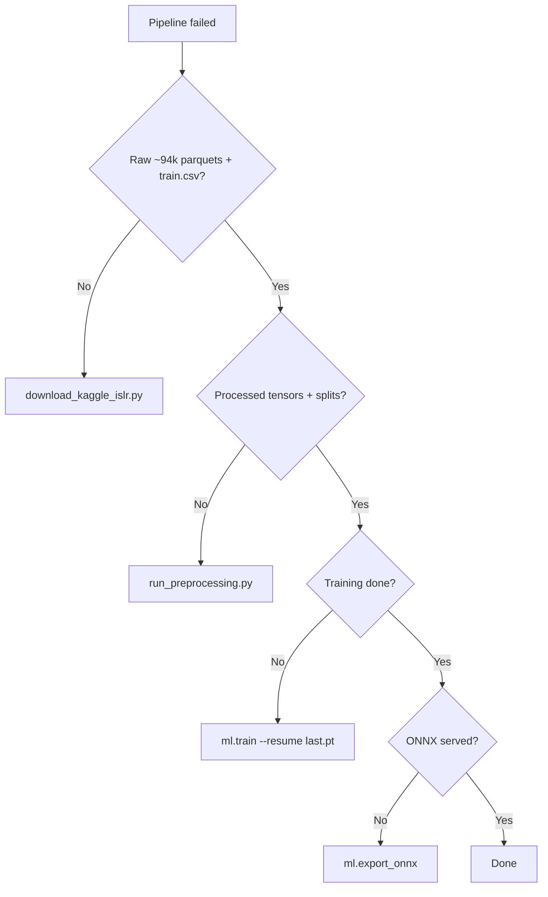

# Pipeline resilience (skip redundant work)

The Kaggle ASL pipeline is long-running. Treat **raw data**, **preprocessed tensors**, and **training checkpoints** as durable artifacts. Re-run only the stage that failed.

## Data root

All paths below are under your data root:

| Platform | How to set |
|----------|------------|
| **Windows (local agents)** | `SIGN_LANGUAGE_DATA_ROOT=D:\PROJECTS\sign language` — persists across Cursor agent runs on your machine. |
| **Cloud agents** | Same env var in the environment, or repo-relative `data/` when unset. |
| **Check location** | `python scripts/pipeline_status.py` |

Configured default in `config/config.yaml` matches the Windows path above; the env var overrides it.

## 1. Keep raw Kaggle data

**Do not delete** `SIGN_LANGUAGE_DATA_ROOT/raw/kaggle_asl_signs/` once you have:

- ~94,000 landmark `.parquet` files (one per sequence)
- `train.csv` with the same row count

The download script skips automatically when this layout is verified (`kaggle_data_ready()`).

```bash
python data/scripts/download_kaggle_islr.py
# SKIP: ... when data is already present
```

If download was interrupted, finish unzip/extract in place; do not wipe the folder unless you intentionally want a full re-download.

## 2. Preprocess cache (config hash)

Processed tensors live at:

```text
processed/kaggle_asl_signs/tensors/<config_hash>/
```

`<config_hash>` is a 12-character hash of preprocess-relevant settings (sequence length `T`, landmark index selection). It changes when **preprocess code or landmark config** changes—not when training fails.

| Situation | Action |
|-----------|--------|
| Training / export failed | **Keep** the `tensors/<config_hash>/` folder; resume training or re-export only. |
| You changed preprocess logic or `config.yaml` landmarks | Delete **only** that hash folder (or run preprocess; a new hash folder is created). |
| Full preprocess completed | `splits/*_tensor_index.json` and `label_map.json` exist under `processed/kaggle_asl_signs/`. |

```bash
python data/scripts/run_preprocessing.py
```

## 3. Training resume

Checkpoints for run name `kaggle_baseline` (default):

```text
models/kaggle_baseline/last.pt   # resume here after crash
models/kaggle_baseline/best.pt   # best validation accuracy
```

After any training failure or VM restart:

```bash
python -m ml.train --resume models/kaggle_baseline/last.pt --run-name kaggle_baseline
```

Optional stability flags (see project notes): `--learning-rate 1e-4`, `--grad-clip-norm 1.0`.

Training without `--resume` starts a new optimization from scratch but still **reads the same processed tensors**—no need to re-preprocess.

## 4. ONNX export only

If training finished but export failed:

```bash
python -m ml.export_onnx --checkpoint models/kaggle_baseline/best.pt
```

## 5. Cloud agents: environment snapshot

After a **successful** Kaggle download + unzip (and ideally after preprocess), take an **environment snapshot** from the Cursor Cloud Agent dashboard so new VMs boot with data already on disk. Pair with **My Secrets** (`KAGGLE_API_TOKEN`) so download auth works on fresh pods without pasting tokens.

Without a snapshot, a new VM must re-download ~GB of competition data unless you attach the same persistent volume path.

## Quick status

```bash
python scripts/pipeline_status.py
```

Prints parquet count, NPZ count for the current config hash, latest checkpoints, and a suggested next command.

## Typical recovery flows


